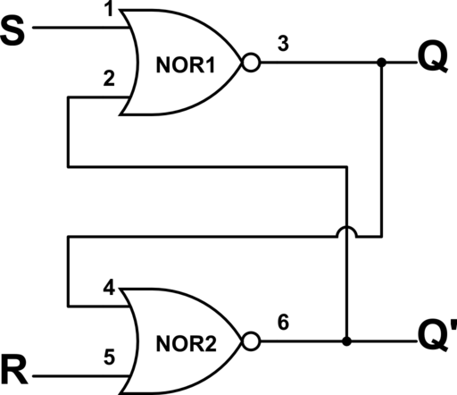
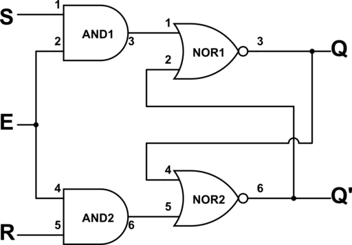
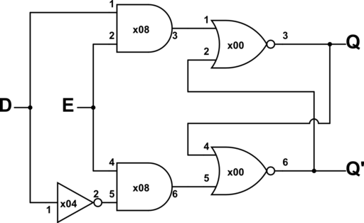

# Pre-lab 4

## 2\)

Table 1: State Transition Table for SR-NOR Latch

|  S  |  R  | Q (present) | Q (next) | Comments |
| :-: | :-: | :---------: | :------: | :------: |
|  0  |  0  |      0      |    0     |   HOLD   |
|  0  |  0  |      1      |    1     |   HOLD   |
|  0  |  1  |      0      |    0     |  RESET   |
|  0  |  1  |      1      |    0     |  RESET   |
|  1  |  0  |      0      |    1     |   SET    |
|  1  |  0  |      1      |    1     |   SET    |
|  1  |  1  |     N/A     |   N/A    |  UNDEF   |
|  1  |  1  |     N/A     |   N/A    |  UNDEF   |

Fig. 1: Logic diagram for SR-NOR latch

## 3\)

Table 2: State Transition Table for SR-NAND Latch

|  S  |  R  | Q (present) | Q (next) |       Comments       |
| :-: | :-: | :---------: | :------: | :------------------: |
|  0  |  0  |     N/A     |   N/A    | UNDEF (OR FORBIDDEN) |
|  0  |  0  |     N/A     |   N/A    |        UNDEF         |
|  0  |  1  |      0      |    1     |         SET          |
|  0  |  1  |      1      |    1     |         SET          |
|  1  |  0  |      0      |    0     |        RESET         |
|  1  |  0  |      1      |    0     |        RESET         |
|  1  |  1  |      0      |    0     |         HOLD         |
|  1  |  1  |      1      |    1     |         HOLD         |

Fig. 2: Logic diagram for SR-NAND latch

same but replace the x02 NOR gates with x00 NAND gates...

## 4/)

Table 3: State Transition Table for Level-Sensitve SR-NAND Latch

| Enable |  S  |  R  | Q (present) | Q (next) | Comments |
| :----: | :-: | :-: | :---------: | :------: | :------: |
|   0    |  0  |  0  |      0      |    0     |   HOLD   |
|   0    |  0  |  0  |      1      |    1     |   HOLD   |
|   0    |  0  |  1  |      0      |    0     |   HOLD   |
|   0    |  0  |  1  |      1      |    1     |   HOLD   |
|   0    |  1  |  0  |      0      |    0     |   HOLD   |
|   0    |  1  |  0  |      1      |    1     |   HOLD   |
|  N/A   |  1  |  1  |      0      |   N/A    |  UNDEF   |
|  N/A   |  1  |  1  |      1      |   N/A    |  UNDEF   |
|   1    |  0  |  0  |      0      |    0     |   HOLD   |
|   1    |  0  |  0  |      1      |    1     |   HOLD   |
|   1    |  0  |  1  |      0      |    0     |  RESET   |
|   1    |  0  |  1  |      1      |    0     |  RESET   |
|   1    |  1  |  0  |      0      |    1     |   SET    |
|   1    |  1  |  0  |      1      |    1     |   SET    |
|  N/A   |  1  |  1  |      0      |   N/A    |  UNDEF   |
|  N/A   |  1  |  1  |      1      |   N/A    |  UNDEF   |

Fig 3. Logic diagram for Level Sensitive NOR latch

## 5\)

Table 4: State Transition Table for Level Sensitive D Latch

| Enable |  D  | Q (present) | Q (next) | Comments |
| :----: | :-: | :---------: | :------: | :------: |
|   0    |  0  |      0      |    0     |   HOLD   |
|   0    |  0  |      1      |    1     |   HOLD   |
|   0    |  1  |      0      |    0     |   HOLD   |
|   0    |  1  |      1      |    1     |   HOLD   |
|   1    |  0  |      0      |    0     |  RESET   |
|   1    |  0  |      1      |    0     |  RESET   |
|   1    |  1  |      0      |    1     |   SET    |
|   1    |  1  |      1      |    1     |   SET    |

Fig 4. Logic diagram for Level Sensitive D Latch

